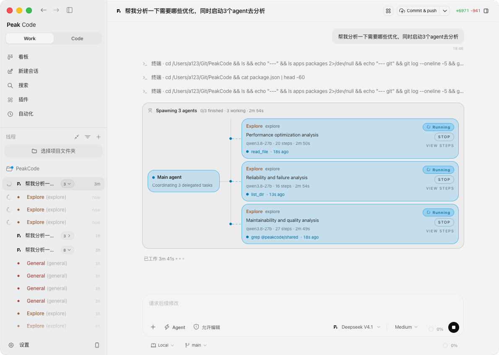
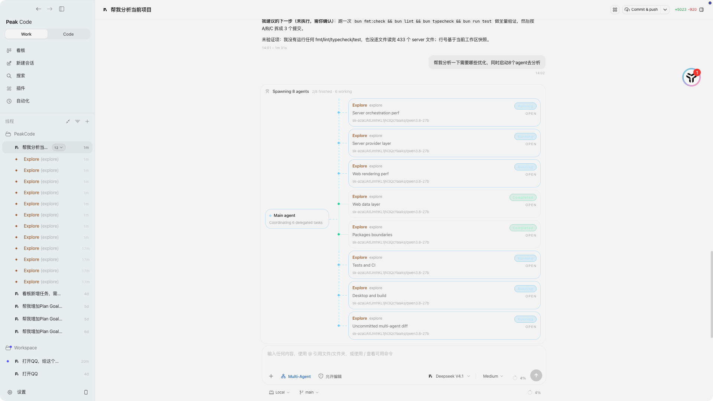

<p align="center">
  
</p>

<h1 align="center">Peak Code</h1>

<p align="center">
  <strong>本地优先的 Pi 编程代理桌面端与 Web 图形界面。</strong><br />
  流式输出、差异对比、看板与定时任务，全部围绕一个代理 —— 并且都跑在你自己的机器上。
</p>

<p align="center">
  <a href="./README.md">English</a> •
  <a href="https://github.com/PeakCode-AI/PeakCode/blob/main/LICENSE">
    
  </a>
  <a href="https://github.com/PeakCode-AI/PeakCode/stargazers">
    
  </a>
  <a href="https://discord.gg/jn4EGJjrvv">
    
  </a>
  <a href="https://github.com/PeakCode-AI/PeakCode/releases">
    
  </a>
</p>

<p align="center">
  <a href="#快速开始">快速开始</a> •
  <a href="#功能特性">功能特性</a> •
  <a href="#架构">架构</a> •
  <a href="#参与贡献">参与贡献</a>
</p>

<p align="center">
  <a href="#社区">
    
  </a>
  <br />
  <sub><b>微信交流群 — 扫码进群沟通。</b>提问、提需求、看进展，都欢迎进群。</sub>
</p>

---


## 为什么选择 Peak Code？

编程代理最大的价值，在于你能看着它干活、随时介入，并且明天还能回到那次运行；而终端给不了这些。Peak Code 把一个代理 —— [Pi](https://github.com/earendil-works/pi) —— 放进为这个循环设计的界面里：

- **先计划，再动代码** —— 输入区会把交互模式（Agent、Plan、Goal）随每条消息一起发出，所以一次请求可以以「待你确认的计划」返回，而不是以「需要回滚的改动」返回。
- **每次运行都可复查** —— 回合实时流式输出，每一轮都记录一个 git 检查点，差异面板展示这一轮改了什么。
- **工作比会话活得更久** —— 会话、看板和定时任务都是你机器上的文件与数据表，而不是厂商云里的状态。
- **自带模型** —— Pi 自己的 `models.json` 可以直接在应用里编辑，任何 OpenAI、Anthropic 或 Google 兼容的端点都能接入。
- **在你代码所在的地方运行** —— 桌面应用（macOS、Windows、Linux），或者你自己托管的 Web 服务。

## 快速开始

### 桌面应用（推荐）

从 [Releases](https://github.com/PeakCode-AI/PeakCode/releases) 下载：

| 平台    | 格式        |
| ------- | ----------- |
| macOS   | `.dmg`      |
| Windows | `.exe`      |
| Linux   | `.AppImage` |

#### macOS 提示「无法验证开发者」

发布包目前尚未使用 Apple Developer ID 签名，Apple Silicon 版 macOS 会拦截下载的
应用：包内带的是 ad-hoc 签名——签名本身有效，但 macOS 无法据此确认开发者身份，
也没有公证（notarization）票据。文件本身是完整的。清除隔离标记（quarantine）后，
从 **应用程序**目录打开即可：

```bash
# 如果安装在别的位置，请替换成实际路径
xattr -dr com.apple.quarantine "/Applications/Peak Code.app"
```

若 macOS 仍拒绝打开，进入 **系统设置 → 隐私与安全性**，找到被拦截的提示并选择
**仍要打开**。

只要仓库配置了 `CSC_LINK`、`CSC_KEY_PASSWORD`、`APPLE_API_KEY`、`APPLE_API_KEY_ID`
和 `APPLE_API_ISSUER` 这几个密钥，构建就会自动签名并公证；在此之前，
`.github/workflows/release.yml` 会输出 `macOS signing disabled` 并发布未签名的构建产物。

### 从源码构建

```bash
git clone https://github.com/PeakCode-AI/PeakCode.git
cd PeakCode
bun install
bun run dev
```

然后打开 **`http://localhost:5733`**。

> **要求：** Bun 1.3.9+（工作区锁定在 `bun@1.3.9`）或 Node.js 24+、Git 2.30+，以及装有至少一个
> 已认证模型的 [Pi](https://github.com/earendil-works/pi)。Peak Code 通过内置的
> `@earendil-works/pi-coding-agent` SDK 在进程内驱动 Pi 代理，并读取 pi 自己的配置目录
> （`~/.pi/agent`）获取模型与凭据。未安装或版本过旧的 `pi` 会显示在提供商状态面板里，也可以在那里
> 就地更新（npm、bun、pnpm 或 Homebrew）。

#### 从源码构建 - Windows

Windows 上服务器需用 Node.js 运行（Bun 尚未实现 ConPTY）。`dev` 命令已自动处理此问题。克隆项目后：

```powershell
# 安装依赖（如果配了私有 npm 仓库，需指定公网 registry）
bun install --registry https://registry.npmjs.org

# 构建服务器（一次性）
bun run build

# 启动开发环境
bun run dev
```

然后浏览器打开 **`http://localhost:5733`**。

> `bun run dev` 自动检测 Windows 并用 Node.js 运行服务器，同时启动 Vite 前端——和 macOS/Linux 同一个命令。

## 功能特性

### 只有一个代理：Pi

Peak Code 只驱动一个代理运行时。Pi 是契约层里唯一的提供商（`ProviderKind = ["pi"]`），由唯一的适配器封装，并且在进程内运行——没有需要守护的代理子进程。这是刻意的取舍：这样应用就能把终端做不到的部分做好，而不必重新实现一个代理。

模型不在 Pi 的管辖范围内，而是由你来定 —— 见下方「模型提供商」。

### 运行模式 —— Agent / Plan / Goal / 多智能体

输入区决定这一轮怎么执行，模式随消息一起发送：

- **Agent**（默认）—— 完整工具集，代理直接在工作区里干活。
- **Plan** —— 只读探索加 `write_plan`，工作区保持不变，结果以计划的形式返回给你确认。
- **Goal** —— 完整工具集加 `goal` 工具。目标与验收标准保存在状态里，由服务端在轮次之间持续续跑，直到目标完成、被放弃或用完预算（受 token 预算和续跑次数上限约束）。
- **多智能体** —— 把这一轮拆给若干个并行工作的子智能体；见下方[多智能体](#多智能体--并行子智能体)。

目标会显示在输入区的目标面板中，可以暂停、恢复、完成或放弃；因预算耗尽而停止的目标状态为 `budget-limited`。

另有一个独立于交互模式的运行时模式（完全访问 / 受监管），决定会话本身的审批与沙箱策略，详见 [`.docs/runtime-modes.md`](./.docs/runtime-modes.md)。

### 多智能体 —— 并行子智能体

第四个模式不自己埋头干活，而是**分出去干**：编排器拆解任务，用 `task` 工具按块派给一个个 worker，最后把回来的结论合并成一份答复。





- **worker 有名字、有自己的模型和工具。** 一个子智能体就是编排器传给 `task` 的句柄，带自己的说明、附加指令、工具白名单和模型。应用自带三个 —— `explore`（只读调研）、`general`（全套工具）、`review`（审阅未提交的改动）—— Settings → 子智能体 里可以增删改。规划/合并用强模型、翻文件搜代码的 worker 用便宜模型，正是这个功能的价值所在，所以每个 worker 的模型与编排器相互独立。
- **先说明计划，再派活。** 一轮里的第一次 `task` 调用会被拒绝一次，直到这一轮已经写出过可见文字 —— 于是一条请求先得到「我打算这样拆、谁做什么」，而不是莫名其妙冒出一堆子智能体。
- **每个 worker 都看得见，也都能单独停。** 一次派发在会话里画出一张委派卡片：一边是编排器，每条分支上是一个 worker，显示它的模型、状态、已经走过的步数、此刻正在跑的工具调用，以及出去了多久。点一行就打开这个 worker 自己的线程，能看到完整的工具记录；**Stop** 只结束这一个 worker，编排器和其余 worker 继续跑。
- **交付物是合并后的结果。** 协议的最后几步是收齐每个 worker 的结论、合并成一份成品答复；「都做完了」不算交付物，失败或被停掉的 worker 会作为缺口写进结论里。

### 模型提供商

Settings → 模型提供商 直接编辑 pi 运行时加载的 `models.json`，因此可以把 Peak Code 指向任何 OpenAI、Anthropic 或 Google 兼容的端点：

- 内置 OpenAI、Anthropic、Google Gemini、OpenRouter、Ollama、DeepSeek 和智谱 AI（GLM）模板，也支持自定义提供商，并在表单里提示 `ENV_VAR` / `!shell` 两种密钥来源写法。
- 就地添加和编辑模型：模型 ID、上下文窗口、最大输出 token，以及模型支持的输入类型（text、image、video、PDF）。
- 保存不会破坏 pi 读取的文件。pi 会严格校验 `models.json`，遇到不认识的输入类型会拒绝整个文件，所以 `video`/`pdf` 存在 pi 会忽略的字段里；清空某个字段时会从配置中删除它，而不是写入空值。

### Pi 包

Settings → Pi 包 可以在应用内安装 [pi 包](https://github.com/earendil-works/pi/blob/main/docs/packages.md) —— 把一个扩展、技能、提示词模板和主题打包成一个来源 —— 不必回到终端：

- 支持 `pi install` 的两种来源：`npm:@scope/pkg`（通过全局 npm 前缀安装）与 `git:host/user/repo`（克隆进 pi agent 目录），也支持本地路径。
- 列表会显示每个包实际贡献了什么 —— 技能、提示词、扩展、主题 —— 以及落盘位置。
- 安装写入的正是 `pi` 自己读取的那个 `settings.json`，因此命令行与应用始终一致。新线程在下次启动时加载；已打开的线程执行 `/reload` 即可。
- 扩展失败不再静默：包加载失败、或扩展处理函数抛错，都会在线程里以警告形式指出是哪个扩展。

现成例子：**pi-crew**（`npm:@melihmucuk/pi-crew`，或 `git:github.com/melihmucuk/pi-crew`）带来六个 `crew_*` 工具，让子代理并行工作而当前回合保持可交互。它的工具、技能与 `/pi-crew-plan`、`/pi-crew-review` 提示词模板在 Peak Code 中可用；TUI 挂件、快捷键和 `@` 提及补全属于终端专属，保持静默。

### 技能与命令

Settings → 技能 列出代理可以读取的技能，每一项都带一个开关：关掉某个技能会保留它的文件，但把它从每轮的技能列表里移除，并让 `read_skill` 拒绝它（存为 `AGENT_DISABLED_SKILLS`）。技能从机器上共享的技能目录导入（`~/.agents/skills`，以及其他代理留下的目录），同时 Peak Code 会在系统层面保持安装 [addyosmani/agent-skills](https://github.com/addyosmani/agent-skills) 技能包，让 DEFINE → PLAN → BUILD → VERIFY → REVIEW → SHIP 工作流在每条新会话里就已就位。主题与两个提示词工程技能移植自 [can1357/oh-my-pi](https://github.com/can1357/oh-my-pi)（MIT）—— 见 [`.docs/oh-my-pi-integration.md`](./.docs/oh-my-pi-integration.md)。

斜杠命令让你不必手写提示词就能用上这些技能：`/compress` 驱动 `semantic-compression`，`/prompt-review` 驱动 `system-prompts`，`/review-prs` 运行本仓库自己的门禁（`scripts/pr-review.sh`）。三者都会先把指令插入输入区，供你阅读后再发送。

### 看板

每个项目在自身目录下都有一块看板，存放在 `.kanban/board.json`，应用、编码代理和其他工具读写的是同一个文件：

- 列为 待开始 / 进行中 / 已完成 / 已阻塞 / 归档，支持拖拽换列。
- 任务进入 进行中（或直接创建在该列）会派发给代理执行。任务的需求是一份带验收标准的敏捷简报，可以由代理根据标题生成。
- 运行结果会写回任务：成功为 已完成，失败为 已阻塞，运行被中断则回到 待开始。
- 任务详情把看板留言与代理在该线程里的消息合并展示，并支持对正在运行的一轮进行引导（steer）或中断。`kanban_comment` 工具让被派发的代理能在自己的卡片上为每个完成的步骤留下一条留言。

### 定时任务

一个定时任务 = 一个计划 + 一句指令 + 一个工作区。到点之后，Peak Code 会在那个工作区里开一条真实会话并把指令发过去 —— 所以每次运行都留下一条可以继续追问、也能转给别人的会话：

- 三种计划：**仅一次**、**每天**、**每周**；时间按 IANA 时区里的墙上时间计算，「每天 09:00」在夏令时切换前后都是 09:00。
- 新建任务时选择工作区。运行就在该项目里进行，用项目的默认模型和你选的模式（Agent / Plan / Goal）。
- 每个任务都留有运行记录：这次怎么结束的、最后一条回复的摘要，以及进入那条会话的入口。
- 随时可以暂停、恢复或立即运行。一次性任务跑完会自动关闭；错过超过 6 小时的触发点会被顺延，而不是补跑。
- 也可以直接对着代理说一句话来创建 —— 「每天早上帮我汇总一下这里的改动」会走 `schedule_task` 工具，落到你当前所在的工作区。

详见 [`.docs/automations.md`](./.docs/automations.md)。

### 即时通讯渠道

在聊天软件里给代理发一条消息，答案就回到那个聊天里 —— 而它同时是一条真实会话，之后可以在应用里打开、继续追问：

- 六个渠道：**微信个人号**（扫码接入；向外长轮询，不需要公网地址）、**飞书 / Lark** 与 **QQ**（长连接）、**企业微信** 与 **微信公众号**（腾讯回调过来，这两个需要公网 HTTPS 地址），以及通用的 **Webhook** —— 群机器人负责播报任务完成，同时提供一条带密钥保护的 HTTP 桥接，任何脚本或快捷指令都能投递任务。
- 每个聊天保留自己的上下文：桥接记住每个对话续在哪条线程上，空闲 12 小时（可配置，`0` 表示永不过期）后自动开一条新会话。
- 正在执行时到达的消息会排队；渠道支持撤回时，「正在处理」的临时提示会在答案落地前被收回。
- **手机访问**不用折腾网络：在设置里开一条 Cloudflare 快速隧道（服务端没要求令牌时会拒绝，因为隧道地址是公开的），再扫配对二维码，就能在手机上打开这个工作区，甚至直接落到当时屏幕上的那条会话。
- 运行默认停在 **approval-required** —— 聊天驱动的回合没有人守在屏幕前。

渠道清单、各自需要的凭据、回调验签算法与 HTTP 接口都在 [`.docs/im-channels.md`](./.docs/im-channels.md)。

### Git、差异与工作树

会话头部就是 git 操作入口 —— 提交、推送、同步、创建 Pull Request；而「暂存」发生在提交对话框里：勾选要进入这次提交的文件、写提交信息、提交。Pull Request 通过 GitHub CLI 创建。

差异面板可以展示某一轮的改动，也可以展示整个分支相对基线的改动；每一轮都会记录一个 git 检查点，这正是「回滚这一轮」所恢复的内容。一条线程既可以跑在项目目录里，也可以跑在它自己的 git 工作树（worktree）中，这样两个代理可以同时改同一个仓库而不用抢工作区；工作树列表与清理在 Settings → 工作树 里。

### 终端与浏览器

每条线程都带一个内嵌的 xterm 终端（服务端由真实 PTY 支撑），工作区页面还提供整屏宽度的终端视图。桌面版另有一个浏览器面板，可以在会话旁边驱动网页，并把截图送回对话。

### 会话持久化

对话以事件溯源方式写入 SQLite（应用目录下的 `state.sqlite`），因此线程、消息、工具调用与审批都能跨重启保留；之前在运行的会话会从保存的游标处恢复。会话状态是本地的 —— 除了模型调用本身，对话内容不会离开你的机器。

### 应用里还有

- **外观** —— 主题系统，包含移植自 oh-my-pi 的 100 个 pi TUI 主题，以及主题包编辑器。
- **中英文界面** —— 完整 i18n，默认简体中文。
- **语音输入** —— 口述内容转写进输入区。
- **用量与速率限制** —— 提供商用量面板与速率限制提示条。
- **通知** —— 长回合结束时发送桌面通知。
- **子智能体线程、侧聊与分叉** —— 从其他线程分出来的会话保留父子关系，[多智能体](#多智能体--并行子智能体)一轮派出去的 worker 线程同样如此。
- **自动更新** —— 桌面版通过 `electron-updater` 自更新。
- **快捷键** —— 见 [KEYBINDINGS.md](./KEYBINDINGS.md)。

## 架构

Peak Code 是一个 Bun monorepo（`bun@1.3.9`，Turborepo，全面使用 Effect-TS），客户端与服务端分层：

```
桌面端 (Electron)  /  浏览器
        │  WebSocket —— Effect RPC + 类型化推送通道
        ▼
   Node.js 服务器（Effect-TS 层图、事件溯源编排）
        │  进程内调用，无子进程
        ▼
   Pi 编程代理（@earendil-works/pi-coding-agent）
        │
        ▼
   state.sqlite（项目、线程、事件、投影）
```

| 层             | 关键组件                                                    |
| -------------- | ----------------------------------------------------------- |
| **展示层**     | React 19 / Vite 界面、Zustand 状态、TanStack Router + Query |
| **应用层**     | WebSocket 之上的 `NativeApi`、类型化推送通道、传输层队列    |
| **领域层**     | 编排命令/事件、投影、反应器（reactor）、检查点              |
| **基础设施层** | Pi 适配器、agent-toolkit、git 服务、PTY 服务、SQLite 存储   |

| 包                       | 职责                                                                    |
| ------------------------ | ----------------------------------------------------------------------- |
| `apps/server`            | WebSocket 服务（`peakcode`）、编排、提供商会话，并托管构建好的 Web 应用 |
| `apps/web`               | React 界面 —— 会话、消息流、终端、看板、定时任务、设置                  |
| `apps/desktop`           | Electron 外壳，把服务端与 Web 应用打包成桌面应用                        |
| `apps/marketing`         | 官网落地页（Astro）                                                     |
| `packages/contracts`     | 提供商事件、WS 协议、模型、看板的 Effect/Schema 契约 —— 仅含 Schema     |
| `packages/agent-toolkit` | 代理 harness：工具、计划、目标、审批、技能及其 sqlite 存储              |
| `packages/shared`        | 服务端与 Web 共用的运行时工具（显式子路径导出）                         |
| `packages/effect-acp`    | Agent Communication Protocol 的 Effect-TS 封装                          |

延伸阅读：[`.docs/runtime-modes.md`](./.docs/runtime-modes.md)、
[`.docs/automations.md`](./.docs/automations.md)、
[`.docs/im-channels.md`](./.docs/im-channels.md)、
[`.docs/skills-and-workflow.md`](./.docs/skills-and-workflow.md)、
[`.docs/workspace-file-explorer.md`](./.docs/workspace-file-explorer.md)、
[`.docs/usage-statistics.md`](./.docs/usage-statistics.md)、
[`.docs/workspace-layout.md`](./.docs/workspace-layout.md)，自托管请看 [REMOTE.md](./REMOTE.md)。

## 开发

```bash
# 完整开发环境（Web UI + 服务器）
bun run dev

# 单独服务
bun run dev:server         # 仅服务器
bun run dev:web            # 仅 Web UI
bun run dev:desktop        # 桌面应用
bun run dev:marketing      # 落地页

# 质量检查
bun run test               # Vitest 测试套件（不要用 `bun test`）
bun run lint               # oxlint
bun run fmt                # oxfmt 格式化
bun run typecheck          # TypeScript 类型检查

# 桌面分发
bun run dist:desktop:dmg   # macOS DMG
bun run dist:desktop:linux # Linux AppImage
bun run dist:desktop:win   # Windows 安装包
```

### Windows 开发

`bun run dev` 自动检测 Windows 并用 Node.js 运行服务器，工作流与 macOS/Linux 一致：

```powershell
# 首次：构建服务器
bun run build

# 一键启动前后端
bun run dev
```

打开 **`http://localhost:5733`**。修改服务器源码后，运行 `bun run build` 重新构建并重启。

> Windows 上 `bun run dev` 会将 Vite（Bun）和 Node.js 服务器作为两个协调进程启动——无需手动开终端或配环境变量。

### 隔离开发

与现有 Peak Code 实例并行运行，避免端口冲突：

```bash
env -u PEAKCODE_AUTH_TOKEN PEAKCODE_PORT_OFFSET=3158 PEAKCODE_NO_BROWSER=1 \
  bun run dev -- --home-dir ./.peakcode-dev --port 58090
```

服务器端口为 `3773` 加偏移量，Web 客户端为 `5733` 加偏移量，`--port` 覆盖服务器端口。
`--home-dir` 让项目、`state.sqlite` 和日志不落进你真实的 `~/.peakcode`；加上 `--dry-run`
可以在不启动任何进程的情况下查看解析后的配置。

## 参与贡献

欢迎贡献！在提交 Issue 或 PR 前请先阅读 [CONTRIBUTING.zh.md](./CONTRIBUTING.zh.md)。

**快速指南：**

- 保持 PR 简洁（< 200 行）
- 每个 PR 只关注一个问题
- 说明**什么**改变了以及**为什么**
- UI 变更请附上修改前后的截图
- 为新功能编写测试

## 社区

- **[GitHub Issues](https://github.com/PeakCode-AI/PeakCode/issues)** — 报告 Bug 和请求功能
- **[Discord](https://discord.gg/jn4EGJjrvv)** — 提问与日常交流
- **[微信交流群](./assets/prod/wechat-group-qr.png)** — 扫码进群，提问、提需求、看进展

如果 Peak Code 对你的工作流有帮助，不妨给它一个 Star——这能帮助更多人发现这个项目。

## 开源许可

[MIT](./LICENSE) — 随意使用、修改和发布。
